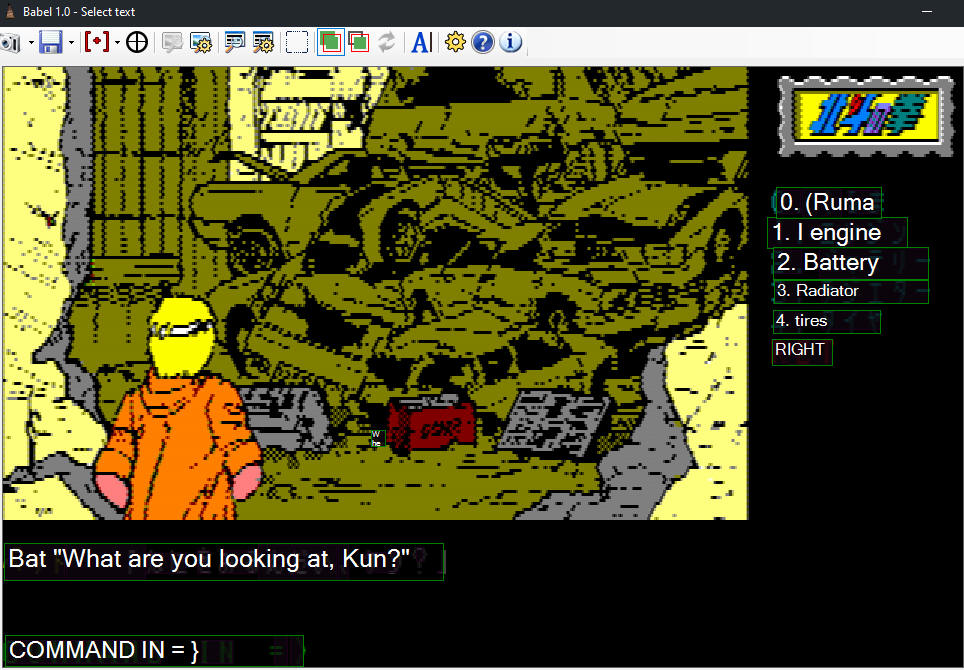

# Babel
Babel is a simple tool leveraging Google Cloud Translation to enable cheap and easy translation of virtually anything that Google understands. We built it because Google refuses to sell or give away a product that actually lets any normal person use their services (the mobile apps don't count, they're virtually unusable.)

Babel is meant for stuff like translating old Japanese videogames - but only enough to get by! Google Translate is no better than any other machine translation service, so don't get it in your head that you can use this to fan-translate that one forgotten Enix RPG for the PC-88. This will let you muddle your way through the menus however:

# Requirements

To use this, you need:

* Windows (no idea if it'll work under Wine or Mono or something)
* Microsoft .NET 4.6.1 or later
* A Google Cloud account with the correct APIs
    * You will need a valid credit card to create one, and you **will** be billed for this service!

Babel includes documentation on how to get a Google Cloud account created.

# Usage

Babel includes documentation on how to use it (in the Help folder) but in short:

* Take a screenshot
* Click a button to have Google OCR it
* Select the text you want to translate
* Done!

# Cost

Babel itself is free, but it depends on Google Cloud, a paid service.

Links in the documentation will take you to the rate sheets for each of the services we're using, and **it's on you to make sure you understand them.** We __think__ that it's really cheap - like, "the first 1000 OCRs a month are free and then it's $1.50/1000 after that," if we understood Google's docs right, but we really aren't experts. It's up to you to make sure you don't get overbilled!

# Streaming Mode

Babel includes a streaming feature. By clicking a button, the current translated text is written to an image file in the folder with transparency so that you can overlay it on a stream with e.g. OBS, allowing your audience to see translations without needing to capture the entire Babel window.

# Donate
If you like this program and want to support its development, a donation would be appreciated!
## [Donate on Ko-Fi](ko-fi.com/gravis)
